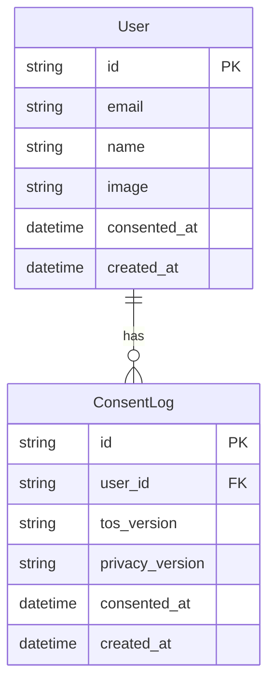

# 기획뷰어 ERD

## 1. 엔티티 목록
| 엔티티 | 설명 | 근거 FR |
|--------|------|---------|
| User | Google OAuth 로그인 사용자 | FR-010, FR-011 |
| ConsentLog | 이용약관·개인정보처리방침 동의 이력 | FR-013, FR-014 |

## 2. 필드 정의

### User
| 필드명 | 타입 | 제약 | 설명 |
|--------|------|------|------|
| id | string | PK | NextAuth 세션 기반 사용자 ID |
| email | string | NOT NULL, UNIQUE | Google OAuth 이메일 |
| name | string | NULL | Google 계정 표시 이름 |
| image | string | NULL | Google 프로필 이미지 URL |
| consented_at | datetime | NULL | 최초 동의 완료 시각 (NULL이면 미동의) |
| created_at | datetime | NOT NULL | 최초 로그인 시각 |

### ConsentLog
| 필드명 | 타입 | 제약 | 설명 |
|--------|------|------|------|
| id | string | PK | 동의 이력 ID |
| user_id | string | FK → User.id, NOT NULL | 동의한 사용자 |
| tos_version | string | NOT NULL | 동의한 이용약관 버전 |
| privacy_version | string | NOT NULL | 동의한 개인정보처리방침 버전 |
| consented_at | datetime | NOT NULL | 동의 완료 시각 |
| created_at | datetime | NOT NULL | 레코드 생성 시각 |

## 3. 관계 정의
| From | Relation | To | 설명 |
|------|----------|----|------|
| User | 1:N | ConsentLog | 한 사용자가 여러 버전의 동의 이력을 가짐 |

## 4. Mermaid ERD

